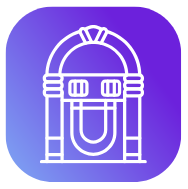

# Flow jukebox

Deployed on **Testnet**: 
- A.9c3f2ba02c56c5c3.FlowJukeBox
- A.9c3f2ba02c56c5c3.FlowJukeBoxTransactionHandler

## About

Flow jukebox is better than any other jukebox, because it works with $FLOW token. 
<p align="center">
  
</p>

## How it works

Jukebox sessions:
- Creating a jukebox - Each jukebox session is an NFT that can be minted by anyone, after paying the minting fee. The NFT lives in the contract wallet.
- Adding songs - Anyone can add songs to a jukebox session, by providing the song info and arbitrary amount of $FLOW token to rank it higher in the queue. More $FLOW backing a song, the earlier the song comes into the queue
- Payout - Each jukebox has limited lifetime. After the jukebox lifetime expires, percentage of accumulated fees for adding songs to the jukebox is paid out to the wallet that created the jukebox session.
- scheduleNextPlay - Contract method, when called checks if session lifetime expired. If true, handles payout and terminates the session, else picks the next song from the queue and plays it. 
- NFT metadata - NFT stores the queue, as well as info on what is now playing and when it started playing.
  
Fully automated jukebox -  using the power of Forte and Scheduled transactions:
1. Jukebox owner creates the jukebox, which mints the NFT and starts autoplay, which runs the first `scheduleNextPlay` transaction.
1. `scheduleNextPlay` transaction plays the next song from the queue. It also reads the song duration and schedules the next `scheduleNextPlay` for once the current song ends.
1. This is repeated for every song from the queue until flow jukebox session is expired. If session expired, `scheduleNextPlay` does not play more songs, but handles payout and destroys the NFT, thus terminating the chain of scheduled transactions.

## Dev Commands (PowerShell)

### Setup
Set variables:  

TESTNET:
```
$SIGNER = "FlowJukeBoxDev3"
$CONTRACTADDR = "0x9c3f2ba02c56c5c3"
$FLOWNETWORK = "testnet"
```

EMULATOR:
```
$SIGNER = "emulator-account"
$CONTRACTADDR = "0xf8d6e0586b0a20c7"
$FLOWNETWORK = "emulator"
```
List accounts:
`flow accounts list`

Add a deployment:
`flow config add deployment`

Update contract:
```
flow project deploy --network $FLOWNETWORK --update
```

### Contract commands

Create a jukebox with songs and start
```
flow transactions send .\cadence\transactions\create_jukebox.cdc ABACAC 7200.0 --signer $SIGNER -n $FLOWNETWORK
flow transactions send .\cadence\transactions\start_autoplay.cdc 1 -n $FLOWNETWORK --signer $SIGNER
flow transactions send .\cadence\transactions\add_entry.cdc 1 "https://www.youtube.com/watch?v=tiSjxSc2hac" "Eva Cassidy - Songbird" 230.0 30.0 --signer $SIGNER -n $FLOWNETWORK
flow transactions send .\cadence\transactions\add_entry.cdc 1 "https://www.youtube.com/watch?v=QHfxMGEb9iE" "Eva Cassidy - You Take My Breath Away
" 269.0 20.0 --signer $SIGNER -n $FLOWNETWORK
flow transactions send .\cadence\transactions\add_entry.cdc 1 "https://www.youtube.com/watch?v=9-hKDYQ6F54" "Eva Cassidy - Wade in the water" 245.0 10.0 --signer $SIGNER -n $FLOWNETWORK
flow transactions send .\cadence\transactions\add_entry.cdc 1 "https://www.youtube.com/watch?v=ccmXWBluxIc" "Eva Cassidy - Ain't no sunshine" 206.0 5.0 --signer $SIGNER -n $FLOWNETWORK
flow transactions send .\cadence\transactions\add_entry.cdc 1 "https://www.youtube.com/watch?v=9UVjjcOUJLE" "Eva Cassidy - Fields of gold" 286.0 5.0 --signer $SIGNER -n $FLOWNETWORK
flow scripts execute .\cadence\scripts\get_jukebox_info.cdc 1 -n $FLOWNETWORK
flow scripts execute .\cadence\scripts\get_queue.cdc $CONTRACTADDR 1 -n $FLOWNETWORK
flow scripts execute .\cadence\scripts\list_jukeboxes.cdc -n $FLOWNETWORK
flow scripts execute .\cadence\scripts\get_users_jukeboxes.cdc $CONTRACTADDR -n $FLOWNETWORK
```

Create a jukebox:
```
flow transactions send .\cadence\transactions\create_jukebox.cdc ABACAC 7200.0 --signer $SIGNER -n $FLOWNETWORK
```

Start the next song and run autoplay to play next or end queue with payout:
```
flow transactions send .\cadence\transactions\start_autoplay.cdc 1 -n $FLOWNETWORK --signer $SIGNER
```

Create and immediately start autoplay
```
flow transactions send .\cadence\transactions\mint_and_start_autoplay.cdc ABACAC 7200.0 --signer $SIGNER -n $FLOWNETWORK
```

Add a song:
```
flow transactions send .\cadence\transactions\add_entry.cdc 1 "youtube.com/blabla" "SongABCD" 20.0 30.0 --signer $SIGNER -n $FLOWNETWORK
```

Get single jukebox details:
```
flow scripts execute .\cadence\scripts\get_jukebox_info.cdc 1 -n $FLOWNETWORK
```

See the queue for a specific jukebox:
```
flow scripts execute .\cadence\scripts\get_queue.cdc $CONTRACTADDR 1 -n $FLOWNETWORK
```

Play next (Admin):
```
flow transactions send .\cadence\transactions\play_next.cdc 1 -n $FLOWNETWORK --signer $SIGNER
```

List all jukeboxes:
```
flow scripts execute .\cadence\scripts\list_jukeboxes.cdc -n $FLOWNETWORK
```

List users jukeboxes:
```
flow scripts execute .\cadence\scripts\get_users_jukeboxes.cdc $CONTRACTADDR -n $FLOWNETWORK
```

Payout:
```
flow transactions send .\cadence\transactions\payout.cdc 1 -n $FLOWNETWORK --signer $SIGNER
```
